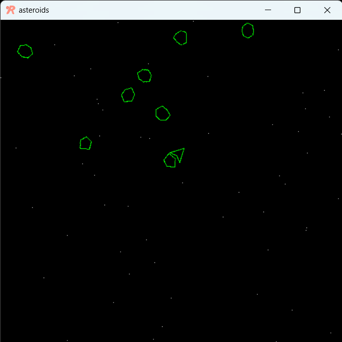
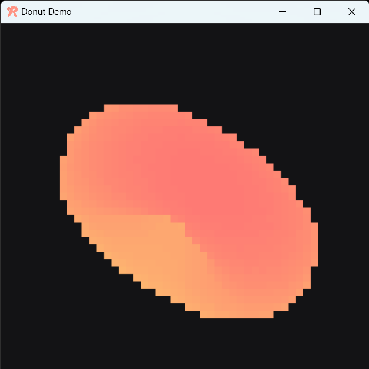
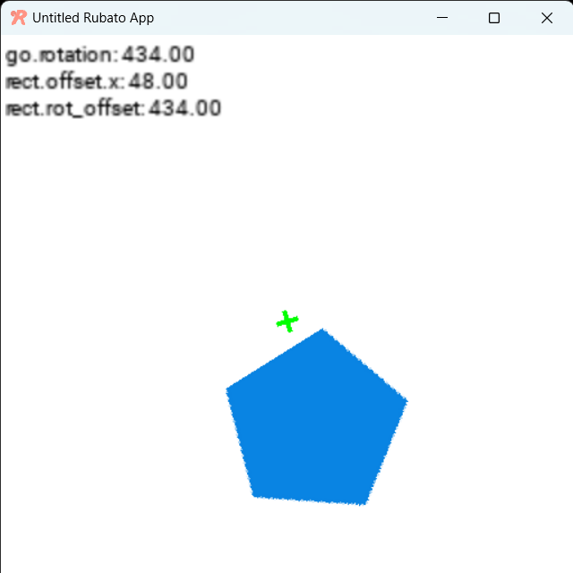
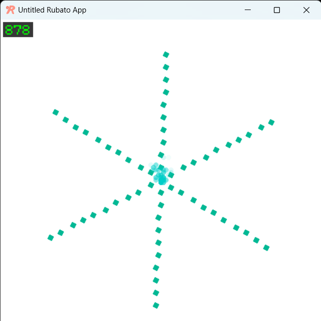
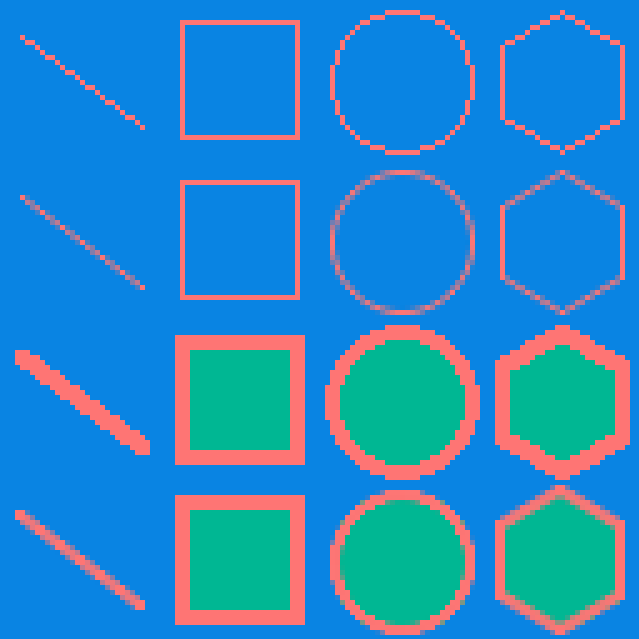

##########################
Demos
##########################

This is a selection of one file demos that show off some of the features of rubato.

Asteroids
************

A basic game in rubato showing off hitboxes: See our asteroids game.

|

.. dropdown:: asteroids.py

    .. literalinclude:: ../../../demo/asteroids.py
        :language: python
        :caption: asteroids.py

Donut
********

A spinning donut showing off ease of math: See our donut demo.

|

.. dropdown:: donut.py

        .. literalinclude:: ../../../demo/donut.py
                :language: python
                :caption: donut.py

Offset
*********

A showcase of the relative offsets of GameObjects and Components: See our offset demo.

|

.. dropdown:: offset_demo.py

        .. literalinclude:: ../../../demo/offset_demo.py
                :language: python
                :caption: offset_demo.py

Particles
************

A spinning particle generator shows the ease of use of our particle system: See our particle demo.

|

.. dropdown:: particles_demo.py

        .. literalinclude:: ../../../demo/particles_demo.py
                :language: python
                :caption: particles_demo.py

Physics
**********

A mosh pit of shapes: See our physics demo.

.. image:: ../_static/demos/physics_demo.png
    :width: 50%
    :align: center

|

.. dropdown:: physics_demo.py

        .. literalinclude:: ../../../demo/physics_demo.py
                :language: python
                :caption: physics_demo.py

Sound
********

A demo of a beautiful voice showing how easy it is to use the sound system: See our sound demo.

.. note::
   No Image for audio lol

|

.. dropdown:: sound_demo.py

        .. literalinclude:: ../../../demo/sound_demo.py
                :language: python
                :caption: sound_demo.py

Surfaces
***********

A rubato surface drawing function demonstration: See our surface demo.

|

.. dropdown:: surface_demo.py

        .. literalinclude:: ../../../demo/surface_demo.py
                :language: python
                :caption: surface_demo.py
